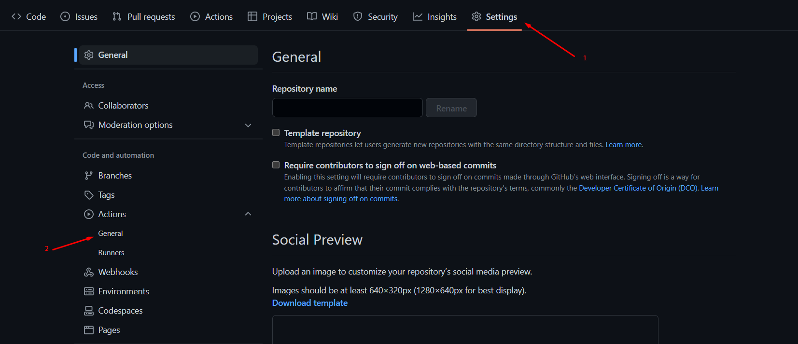
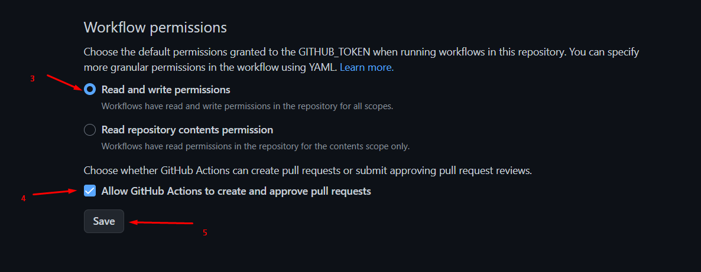
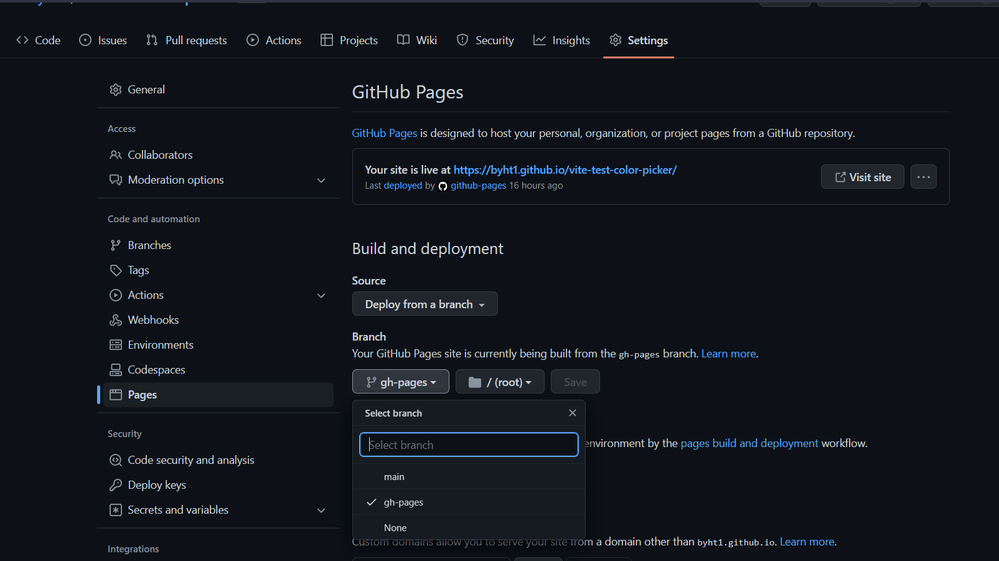
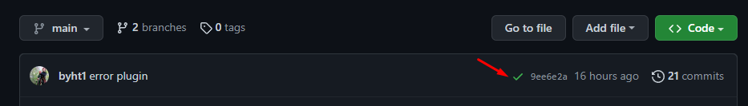

# Vite Create React App

<div style="text-align: center; matgin: 0 auro;">
    <a href="https://vitejs.dev/"  target="_blank" rel="noreferrer">
        
    </a>
    <a href="https://firebase.google.com/" target="_blank" rel="noreferrer">
        
    </a>
</div>

## Деплой

Для настройки деплоя проекта необходимо выполнить несколько дополнительных шагов
по настройке твоего репозитория. Зайди во вкладку `Settings` и в подсекции
`Actions` выбери выбери пункт `General`.



Пролистай страницу до последней секции, в которой выбери опции как на следующем
изображении и нажми `Save`. Без этих настроек у сборки будет недостаточно прав
для автоматизации процесса деплоя.



Продакшн версия проекта будет автоматически проходить линтинг, собираться и
деплоиться на GitHub Pages, в ветку `gh-pages`, каждый раз когда обновляется
ветка `main`. Например, после прямого пуша или принятого пул-реквеста. Для этого
необходимо в файле `package.json` отредактировать поле `homepage`, заменив
`your_username` и `your_repo_name` на свои, и отправить изменения на GitHub.

```json
"homepage": "https://your_username.github.io/your_repo_name/"
```

Далее необходимо зайти в настройки GitHub-репозитория (`Settings` > `Pages`) и
выставить раздачу продакшн версии файлов из папки `/root` ветки `gh-pages`, если
это небыло сделано автоматически.



### Статус деплоя

Статус деплоя крайнего коммита отображается иконкой возле его идентификатора.

- **Желтый цвет** - выполняется сборка и деплой проекта.
- **Зеленый цвет** - деплой завершился успешно.
- **Красный цвет** - во время линтинга, сборки или деплоя произошла ошибка.

Более детальную информацию о статусе можно посмотреть кликнув по иконке, и в
выпадающем окне перейти по ссылке `Details`.



### Живая страница

Через какое-то время, обычно пару минут, живую страницу можно будет посмотреть
по адресу указанному в отредактированном свойстве `homepage`. Например, вот
ссылка на живую версию для этого репозитория
[https://goitacademy.github.io/react-homework-template](https://goitacademy.github.io/react-homework-template).

Если открывается пустая страница, убедись что во вкладке `Console` нет ошибок
связанных с неправильными путями к CSS и JS файлам проекта (**404**). Скорее
всего у тебя неправильное значение свойства `homepage` в файле `package.json`.

### Маршрутизация

Если приложение использует библиотеку `react-router-dom` для маршрутизации,
необходимо дополнительно настроить компонент `<BrowserRouter>`, передав в пропе
`basename` точное название твоего репозитория. Слеши в начале и конце строки
обязательны.

```jsx
<BrowserRouter basename="/your_repo_name">
  <App />
</BrowserRouter>
```

В файлк `vite.config.ts`

```ts
export default defineConfig({
  ... ,
  base: "/your_repo_name",
})
```

## Как это работает


1. После каждого пуша в ветку `main` GitHub-репозитория, запускается специальный
   скрипт (GitHub Action) из файла `.github/workflows/deploy.yml`.
2. Все файлы репозитория копируются на сервер, где проект инициализируется и
   проходит линтинг и сборку перед деплоем.
3. Если все шаги прошли успешно, собранная продакшн версия файлов проекта
   отправляется в ветку `gh-pages`. В противном случае, в логе выполнения
   скрипта будет указано в чем проблема.
